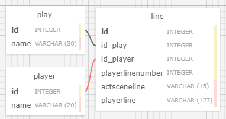

# Simple API Tutorial

In this tutorial we're going to write a somewhat simple database application to store and query lines from two of William Shakespeare's plays.

Admittedly, the Schema will be over-engineered for demonstration reasons.

In our application we will check to see if our table exists, and if not, we'll create it.

Then we will parse the JSON files in the data/ directory and populate the tables.

Then we will do various queries on our data.

## Schema



The tables are defined as follows:

### Table: play

```sql
CREATE TABLE play (
 id BIGSERIAL,
 name BIGSERIAL NOT NULL
);

ALTER TABLE play ADD CONSTRAINT play_pkey PRIMARY KEY (id);
```

### Table: player

```sql
CREATE TABLE player (
 id BIGSERIAL,
 name VARCHAR(20) NOT NULL
);

ALTER TABLE player ADD CONSTRAINT player_pkey PRIMARY KEY (id);
```

### Table: line

```sql
CREATE TABLE line (
 id BIGSERIAL,
 id_play INTEGER,
 id_player INTEGER,
 playerlinenumber INTEGER,
 actsceneline VARCHAR(15),
 playerline VARCHAR(127) NOT NULL DEFAULT 'NULL'
);

ALTER TABLE line ADD CONSTRAINT line_pkey PRIMARY KEY (id);

ALTER TABLE line ADD CONSTRAINT line_id_play_fkey FOREIGN KEY (id_play) REFERENCES play(id);
ALTER TABLE line ADD CONSTRAINT line_id_player_fkey FOREIGN KEY (id_player) REFERENCES player(id);
```
